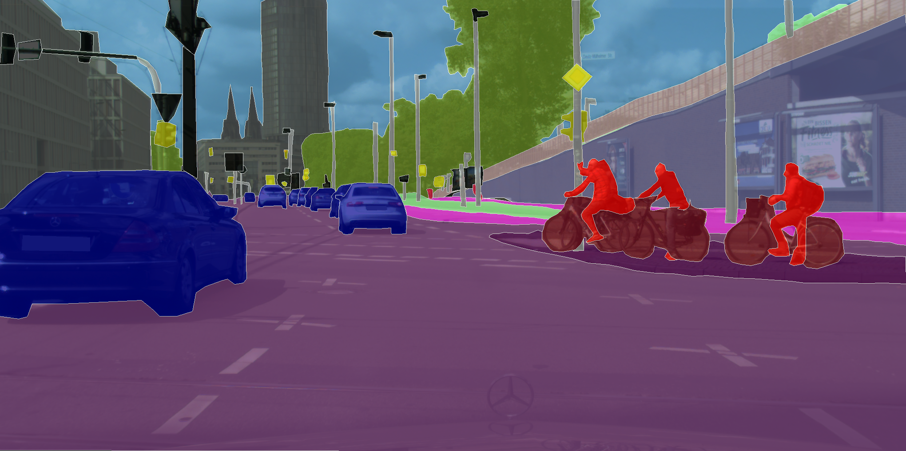
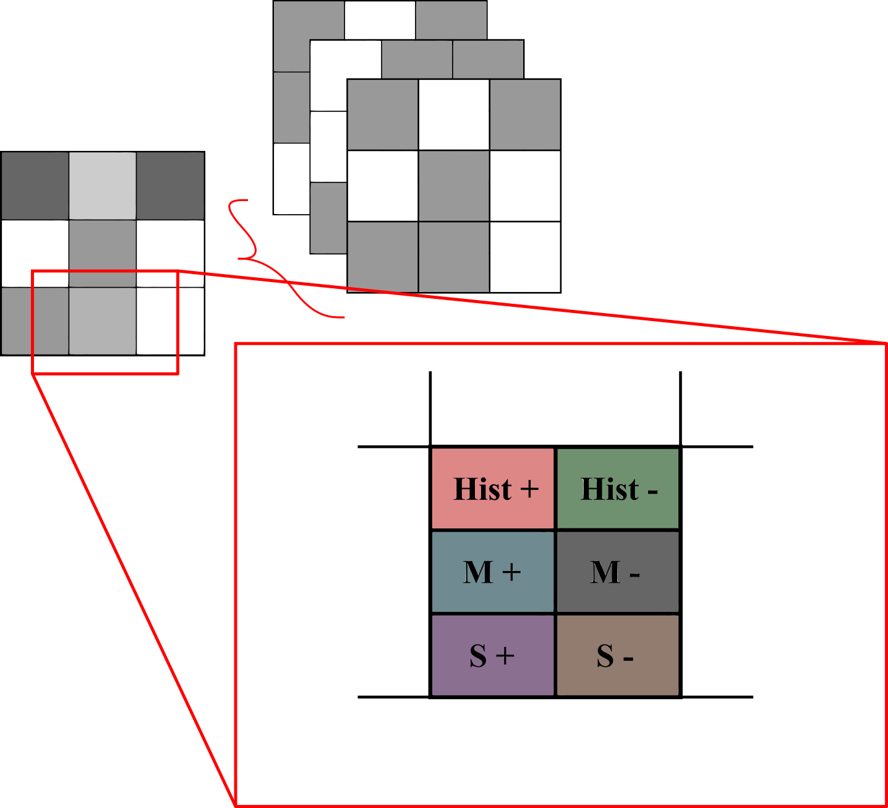

# A Reproduction of EV-SegNet: Semantic Segmentation for Event-based Cameras

<b><i>
In 2018, a method was proposed by Iñigo Alonso and Ana C. Murillo for the semantic
segmentation of scenes from the DDD17 dataset (DAVIS Driving Dataset). Semantic
segmentation (i.e. labelling different types of objects in an image) of street scenes had
been a common application for deep neural networks. 
So then what was the catch? Whereas traditional methods use camera images as input,
EV-SegNet uses event-based data, a datatype that is notoriously unintuitive and hard to
interpret for both human and computer brains. As if the challenge was not large enough
yet, no existing labeled dataset was available (at the time). 
In the context of the 'Reproducibility project' for the Deep Learning course at Delft
University of Technology, we attempted to reproduce the results presented in Alonso and
Murillo's paper. This blogpost aims to clarify the main concepts from the original paper
and presents the reproduction results.
</i></b>

## Background Information

In order to make sure that the methodology in the original paper [^1] and reproduction is
clear, we will shortly go over some key concepts essential to understanding the process.

### Event-based cameras

What are event-based cameras? In contrast to traditional camera sensors, event-based
sensors capture, well... events. Simply said: a *normal* camera captures the intensity of
light at a certain location (pixel) on the sensor, the sensor records these intensities at
all pixels at once, some interpretation of these values later, we have an image. In any
case, the idea is that the photograph contains a snapshot in time of this light intensity
data. Event-based sensors, however, only capture *changes* in intensity at a certain pixel
and at a certain time.

Consider the image below, in the top row we see a representation of a classic camera
image: as can be seen, the orange star moves slightly to the left from frame 1 to frame 2,
however, based on a single frame we would never know if the star was moving, they are
snapshots in time. The bottom row are the event-based representations of the top row: at
the first timestep, no changes are noted. At the second step, once the star has moved,
some receptors observe a _change_ in intensity.

Important to note is that this representation of event-based images already show a certain
interpretation of the event data! In fact, data from event-based cameras can hardly be
called an image. The data consists of data points, each containing a timestamp, a location
on the sensor, and a measure of the intensity change. Depending on the interpretation of
the intensity change, different representations of event-based data can be obtained.
[This link](https://www.youtube.com/watch?v=MjX3z-6n3iA) provides an example of
event-based cameras in action.

### Semantic (pixel level) image segmentation

Semantic segmentation is the process whereby images are segmented and labeled (through a
machine learning process) according to object types/classes that are relevant to the
application. In the example below (obtained from
the [CityScapes Dataset](https://www.cityscapes-dataset.com/examples/)), the classes could
be _car_ (blue), _cyclist_ (red) and _road_ (light purple) among others.

## Original method

### Event Representation

As mentioned, the representation of event data depends heavily on the manner in which it
is processed. The most common way to present event data corresponding to a certain
time-step _ti_ as an image is to arrange the data points in an image grid
according to the recorded positions _x_ and _y_, each of these pixels contain information
on the events that took place during some time interval containing _ti_.

As a reference, this image aims to clarify the concept: A white pixel conveys the absence
of a datapoint (i.e. no event was recorded at that time, at that location).

The nature of the information in a pixel varies from method to method, for example one
could take the integral of the events in the time interval. Additionally, different kinds
of information can be stored in different channels, the same way RGB images' pixels record
the intensity of red, green and blue wavelengths. For example, 2 channels can separate
positive and negative events.

The method that was proposed stores the event information in 6 channels. The first one is
a histogram, it simply accumulates all the magnitudes of the events over the time
interval, summing them together. Second is the mean of all events in the time interval and
third the standard variation. These three methods all split the information into a
positive and a negative channel, resulting in 6 channels.

Please note that the colours in the figure are only meant to signify the various channels,
they do not convey actual values, nor are the channels interpreted as colours in the
original method. Below an example[^1] of three negative channels can be found.

### Ground truth labels

One of the main challenges that Alonso and Murillo faced, was the scarcity of available
data. The [DDD17 Dataset](http://sensors.ini.uzh.ch/news_page/DDD17.html)
was one of the few event-based datasets for driving environments. The data contains
greyscale images alongside the event-data, however it does not contain ground truth
labels.

As to avoid having to generate the label by hand, which is not only time-consuming but can
be quite difficult as well, they employed a CNN and trained it on grayscale images from
the CityScapes Dataset (that _did_ have ground truths) to generate labels on the greyscale
images that accompany the DDD17 event-data. These results had an MIoU score of 83% which
they deemed sufficient to serve as ground truths for the event data.

### CNN architecture

Since CNN architectures are well known for their good performance on segmentation tasks,
the method proposed in the paper employed an architecture heavily inspired on such. The
architecture made use of the Xception[^2] model as an encoder and used backpropagation on
the per-pixel cross-entropy loss to optimize the model.

### Their results

| Input                | Accuracy (50ms) | MIoU (50ms) | Accuracy (10ms) | MIoU (10ms | Accuracy (250ms) | MIoU (250ms) |
| -------------------- | --------------- | ----------- | --------------- | ---------- | ---------------- | ------------ |
| Event representation | 89.76           | 54.81       | 86.46           | 45.85      | 87.72            | 47.56        |
| Grayscale image      | 94.67           | 64.98       | 94.67           | 64.98      | 94.67            | 64.98        |
| Combined             | 95.22           | 68.36       | 95.18           | 67.95      | 95.29            | 68.26        |

## Reproduction

The goal of our reproduction is to attempt to make their method robust for the future:
back in 2018, Alonso and Murillo built their method on Python 2.7 and TensorFlow 1.11
structures. We attempted to adapt their code to be compatible with Python 3.x and
TensorFlow 2.7. Additionally, we checked the performance of the algorithm when provided
with newly generated ground truth labels for the testset.

### Results

[What we did :

- [ ] Replicated: A full implementation from scratch without using any pre-existing code.
- [x] Reproduced: Existing code was evaluated
- [ ] Hyperparams check: Evaluating sensitivity to hyperparameters.
- [x] New data: Evaluating different datasets to obtain similar results.
- [ ] New algorithm variant: Evaluating a slightly different variant.
- [x] New code variant: Rewrote or ported existing code to be more efficient/readable.
- [ ] Ablation study: Additional ablation studies.

]

## Conclusion

## Discussion

This reproduction was performed in the context of Delft University of Technology's course
on Deep Learning. Our team consisted of three members: Rafaël Beckers, Evert De Vroey and
Roy Vorster.

Both Rafaël and Roy were mainly responsible for the technical aspects of this
reproduction: adapting the original code to be compatibel with modern methods. Evert 
was mainly responsible for communicating the results, namely writing this blogpost.

[discussion on results]

Some setbacks were encountered during the project. For a start, 2 of the 3 members 
were unable to harvest the power of their GPU processors, due to incompatibility or 
other issues with the Nividia CUDA system.

## References

[^1]: Iñigo Alonso and Ana C. Murillo. _Ev-segnet: Semantic segmentation for event-based
cameras_. 2018. URL: [https://arxiv.org/abs/1811.12039](https://arxiv.org/abs/1811.12039)

[^2]: F. Chollet. Xception: Deep learning with depthwise separable convolutions. 2017 IEEE
Conference on Computer Vision and Pattern Recognition (CVPR), pages 1800–1807, 2017.