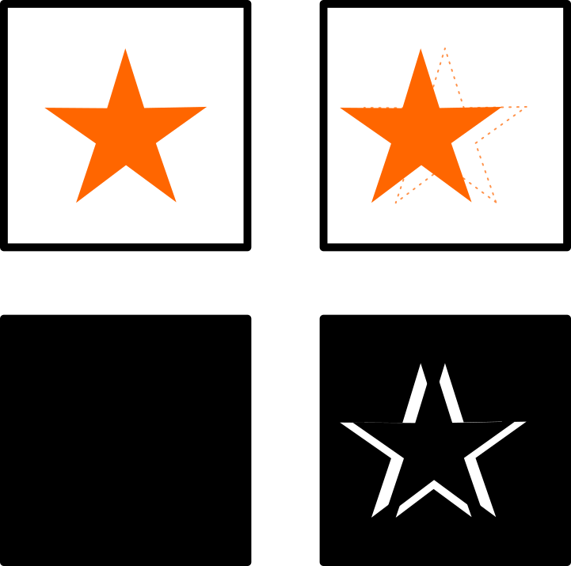

# A Reproduction of EV-SegNet: Semantic Segmentation for Event-based Cameras

<b><i>
In 2018, a method was proposed by Iñigo Alonso and Ana C. Murillo for the semantic
segmentation of scenes from the DDD17 dataset (DAVIS Driving Dataset). Semantic
segmentation (i.e. labelling different types of objects in an image) of street scenes had
been a common application for deep neural networks. 
So then what was the catch? Whereas traditional methods used camera images as input,
EV-SegNet uses event-based data, a datatype that is notoriously unintuitive and hard to
interpret for both human and computer brains. As if the challenge was not large enough
yet, no existing labeled dataset was available (at the time). 
In the context of the 'Reproducibility project' for the Deep Learning course at Delft
University of Technology, we attempted to reproduce the results presented in Alonso and
Murillo's paper.
</i></b>

## Background Information

In order to make sure that the methodology in the original paper [^1] and reproduction is
clear, we will shortly go over some key concepts essential to understanding the process.

### Event-based cameras

What are event-based cameras? In contrast to traditional camera sensors, event-based
sensors capture, well... events. Simply said: a *normal* camera captures the intensity of
light at a certain location (pixel) on the sensor, the sensor records these intensities at
all pixels at once, some interpretation of these values later, we have an image. In any
case, the idea is that the photograph contains a snapshot in time of this light intensity
data. Event-based sensors, however, only capture *changes* in intensity at a certain pixel
and at a certain time.

Consider the image below, in the top row we see a representation of a classic camera
image: as can be seen, the orange star moves slightly to the left from frame 1 to frame 2,
however, based on a single frame we would never know if the star was moving, they are
snapshots in time. The bottom row are the event-based representations of the top row: at
the first timestep, no changes are noted. At the second step, once the star has moved,
some receptors observe a _change_ in intensity.

Important to note is that this representation of event-based images already show a certain
interpretation of the event data! In fact, data from event-based cameras can hardly be
called an image. The data consists of data points, each containing a timestamp, a location
on the sensor, and a measure of the intensity change. Depending on the interpretation of
the intensity change, different representations of event-based data can be obtained.
[This link](https://www.youtube.com/watch?v=MjX3z-6n3iA) provides an example of
event-based cameras in action.

### Semantic (pixel level) image segmentation

Semantic segmentation is the process whereby images are segmented and labeled (through a
machine learning process) according to object types/classes that are relevant to the 
application. In the example below, the classes could be _car_ (blue), _cyclist_ (red) 
and _road_ (light purple) among others.

### Original method

## Reproduction

[philosophy: make the method robust for modern day]

[What we did :

- [ ] Replicated: A full implementation from scratch without using any pre-existing code.
- [X] Reproduced: Existing code was evaluated
- [ ] Hyperparams check: Evaluating sensitivity to hyperparameters.
- [X] New data: Evaluating different datasets to obtain similar results.
- [ ] New algorithm variant: Evaluating a slightly different variant.
- [X] New code variant: Rewrote or ported existing code to be more efficient/readable.
- [ ] Ablation study: Additional ablation studies.

]

## Conclusion

## References

[^1]: Iñigo Alonso and Ana C. Murillo. _Ev-segnet: Semantic segmentation for event-based
cameras_. 2018. URL: [https://arxiv.org/abs/1811.12039](https://arxiv.org/abs/1811.12039),

[^2]: Obtained
from [CityScapes](https://www.cityscapes-dataset.com/examples/#fine-annotations) Dataset
